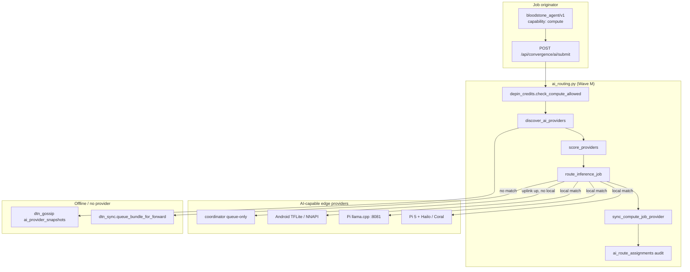
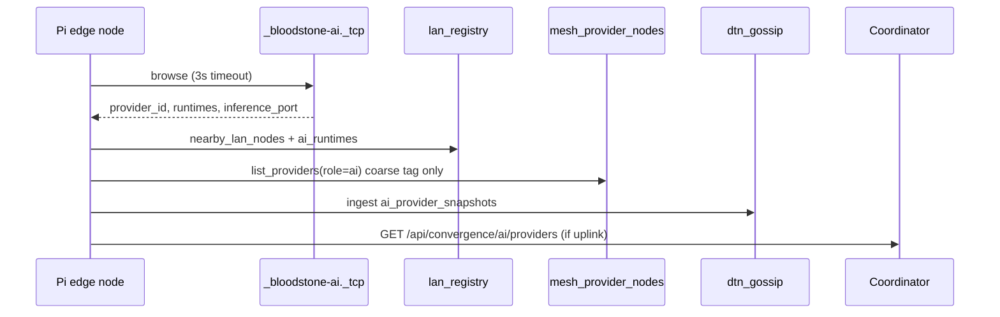
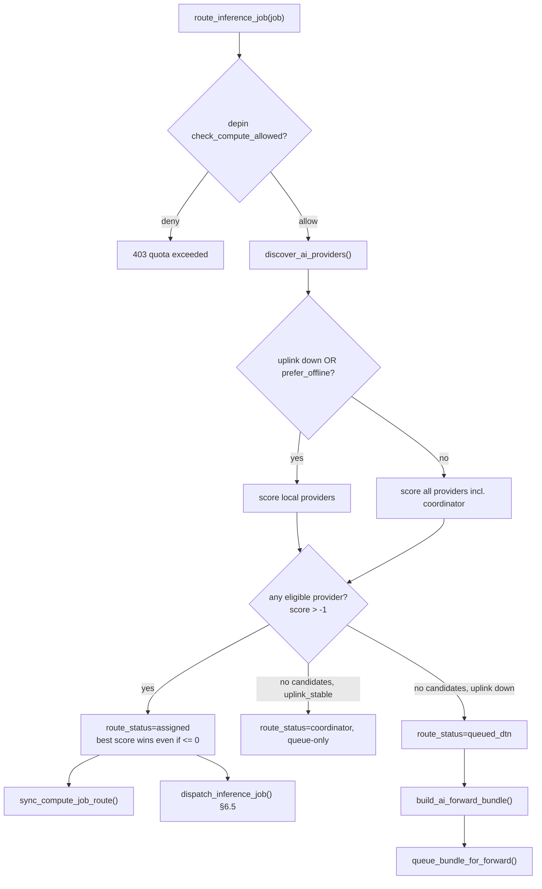

# Wave M — On-Device AI Routing

**Status:** Draft (rev. 3 — re-review issues 27–31 addressed)  
**Date:** July 8, 2026  
**Version target:** v0.23.0-beta (sequential beta after Wave L / v0.22.0-beta; confirm against GitLab release playbook before tag)  
**Stack:** Bloodstone-Blurt Convergence on Raspberry Pi edge nodes  
**Prior waves:** A–L shipped (latest: Wave L — `bloodstone_bridge_swap/v1`)

---

## 1. Executive Summary

Wave M introduces a **beta scaffold** for **on-device AI routing** — the Layer 3 white-paper gap (“on-device AI routing, 2030+”). Rather than building a full inference runtime, Wave M wires **discovery, scoring, dispatch, and fallback** so `inference` compute jobs route to the best **local** AI-capable provider (Pi NPU/GPU, Android handset, LAN coordinator) when uplink is down, with DTN queueing when no provider is available.

The design extends existing Wave F (`bloodstone_compute_job/v1`) and Wave G memo rails (`compute:<STONE>:<job_id>`) rather than inventing a parallel job system. A new manifest format `bloodstone_ai_provider/v1` advertises runtime capabilities (`onnx`, `llama.cpp`, `tflite`, `cpu-inference`). **Full provider capability detail lives in `bloodstone_ai_providers`** (source of truth); `mesh_provider_nodes.roles` may include coarse `"ai"` tagging only.

Routing decisions are persisted in `ai_route_assignments` (audit/history) and **synchronized to `bloodstone_compute_jobs.provider_id` and `status`** (operational source of truth). Providers are gossiped and exported in DTN bundles alongside compute jobs.

**Deliverable posture:** routing orchestration + APIs + Pi upkeep hooks. Actual model execution remains provider-local (llama.cpp server, ONNX Runtime, TFLite delegate) behind a thin HTTP shim introduced in PR 6.

---

## 2. Goals & Non-Goals

### Goals

| # | Goal |
|---|------|
| G1 | Discover AI-capable providers on LAN/mesh (capabilities: `onnx`, `llama.cpp`, `tflite`, `cpu-inference`) |
| G2 | Route `job_type=inference` compute jobs to the best **local** provider when uplink is unavailable |
| G3 | Fall back to coordinator (queue-only, no HTTP dispatch in beta) or DTN forward queue when no local provider matches |
| G4 | Integrate with `bloodstone_compute_job/v1` manifests and `compute:<STONE>:<job_id>` memo enforcement |
| G5 | Expose APIs consistent with prior waves: `/api/convergence/ai/status`, `route`, `providers`, `submit` |
| G6 | Wire into `sync-blurt-convergence.py` upkeep and `chain_mesh/convergence.py` roadmap |

### Non-Goals (Wave M beta)

- Training pipelines, federated learning, or model marketplace
- Global DHT-based AI provider registry (LAN + gossip + coordinator only)
- On-device model download / OTA weight sync (input assets via existing chunk mesh only)
- Full Android JNI inference integration (advertise + route only; execution stub on Pi)
- Coordinator HTTP inference dispatch (returns `route_status=coordinator`; operator/coordinator queue handles job)
- Replacing `bloodstone_compute_job/v1` — inference jobs remain compute jobs with optional `ai_spec` extension

---

## 3. Architecture Overview



### Module layout (new + touched)

| File | Role |
|------|------|
| `chain_mesh/ai_routing.py` | **New** — provider registry, discovery, scoring, dispatch, route/job sync |
| `chain_mesh/ai_provider.py` | **New** — `bloodstone_ai_provider/v1` manifest build/index/sync |
| `chain_mesh/compute_job.py` | Extend inference body with optional `ai_spec` block (see §4.5) |
| `chain_mesh/mesh_providers.py` | Optional coarse `ai` role in `roles` JSON array (no new column) |
| `chain_mesh/mdns_discovery.py` | Register/browse `_bloodstone-ai._tcp` |
| `chain_mesh/dtn_sync.py` | `ai-providers.json`, `ai-route-assignments.json`, `build_ai_forward_bundle()` |
| `chain_mesh/dtn_gossip.py` | Export + ingest `ai_provider_snapshots` |
| `chain_mesh/convergence.py` | Layer 3 detail + roadmap Wave M |
| `chain_mesh/api.py` | `convergence_ai_*_payload` wrappers; extend `lan_register()` |
| `bloodstone-portal/app.py` | Flask routes under `/api/convergence/ai/*` |
| `bloodstone-miner-web/app.py` | **Required** mirror routes for Pi LAN UX |
| `sync-blurt-convergence.py` | `ai_routing.upkeep_ai()` cycle (PR 5 only) |
| `tests/test_ai_routing.py` | Scoring + route/job sync unit tests (PR 1) |
| `ops/bloodstone-pi-fleet/convergence.env.example` | Wave M env block |

**Source of truth for AI capabilities:** `bloodstone_ai_providers` table only. `mesh_provider_nodes.roles` may include `"ai"` as a coarse tag; it does **not** store runtime/model detail.

---

## 4. Data Models

### 4.1 AI Provider Manifest — `bloodstone_ai_provider/v1`

Blurt `custom_json` id (optional broadcast; local registration is primary for beta).

```json
{
  "v": "1",
  "provider_id": "pi-shed-01-ai",
  "peer_id": "12D3KooWabc...",
  "node_id": "pi-shed-01",
  "stone_address": "STONE1abc...xyz",
  "agent_id": "shed-agent",
  "display_name": "Shed Pi — llama.cpp",
  "runtimes": ["llama.cpp", "cpu-inference"],
  "models": [
    {
      "model_id": "llama-3.2-1b-q4",
      "runtime": "llama.cpp",
      "format": "gguf",
      "max_context": 4096,
      "vram_mb": 0,
      "tags": ["chat", "summarize"]
    }
  ],
  "hardware": {
    "kind": "raspberry-pi-5",
    "npu": "",
    "gpu": "",
    "ram_mb": 8192
  },
  "endpoints": {
    "inference_url": "http://192.168.1.10:8081/v1/completions",
    "health_url": "http://192.168.1.10:8887/api/convergence/ai/provider/health"
  },
  "region": "lan-west",
  "offline_capable": true,
  "max_concurrent": 2,
  "flops_per_sec": 500000000,
  "created_at": 1752019200
}
```

**Validation constants** (`ai_provider.py`):

```python
AI_PROVIDER_ID = "bloodstone_ai_provider/v1"
VALID_RUNTIMES = frozenset({"onnx", "llama.cpp", "tflite", "cpu-inference"})
VALID_HARDWARE_KINDS = frozenset({
    "raspberry-pi-4", "raspberry-pi-5", "android", "desktop", "coordinator", "custom"
})
```

### 4.2 SQLite — `bloodstone_ai_providers`

```sql
CREATE TABLE IF NOT EXISTS bloodstone_ai_providers (
    provider_id TEXT PRIMARY KEY,
    peer_id TEXT NOT NULL DEFAULT '',
    node_id TEXT NOT NULL DEFAULT '',
    stone_address TEXT NOT NULL DEFAULT '',
    agent_id TEXT NOT NULL DEFAULT '',
    display_name TEXT NOT NULL DEFAULT '',
    runtimes TEXT NOT NULL DEFAULT '[]',        -- JSON array (denormalized)
    models_json TEXT NOT NULL DEFAULT '[]',
    hardware_json TEXT NOT NULL DEFAULT '{}',
    endpoints_json TEXT NOT NULL DEFAULT '{}',
    region TEXT NOT NULL DEFAULT 'global',
    offline_capable INTEGER NOT NULL DEFAULT 1,
    max_concurrent INTEGER NOT NULL DEFAULT 1,
    flops_per_sec INTEGER NOT NULL DEFAULT 0,
    load_ratio REAL NOT NULL DEFAULT 0,         -- 0.0–1.0 heartbeat
    source TEXT NOT NULL DEFAULT 'local',       -- local|mdns|gossip|manual|coordinator|lan
    provider_json TEXT NOT NULL DEFAULT '{}',
    last_seen INTEGER NOT NULL,
    created_at INTEGER NOT NULL
);
CREATE INDEX IF NOT EXISTS idx_ai_provider_region
    ON bloodstone_ai_providers(region, last_seen DESC);
CREATE INDEX IF NOT EXISTS idx_ai_provider_last_seen
    ON bloodstone_ai_providers(last_seen DESC);

-- Normalized runtime index for GET /providers?runtime=...
CREATE TABLE IF NOT EXISTS ai_provider_runtimes (
    provider_id TEXT NOT NULL,
    runtime TEXT NOT NULL,
    PRIMARY KEY (provider_id, runtime)
);
CREATE INDEX IF NOT EXISTS idx_ai_provider_runtime_lookup
    ON ai_provider_runtimes(runtime, provider_id);
```

`register_ai_provider()` upserts both tables. Runtime-filtered queries join `ai_provider_runtimes`.

### 4.3 SQLite — `ai_route_assignments`

**Audit/history table** — not the sole dispatch record. Operational truth is `bloodstone_compute_jobs.provider_id` + `status` (see §4.6).

```sql
CREATE TABLE IF NOT EXISTS ai_route_assignments (
    id INTEGER PRIMARY KEY AUTOINCREMENT,
    job_id TEXT NOT NULL,
    stone_address TEXT NOT NULL,
    provider_id TEXT NOT NULL DEFAULT '',
    route_status TEXT NOT NULL DEFAULT 'pending',
    -- pending | assigned | running | completed | failed | queued_dtn | coordinator
    score REAL NOT NULL DEFAULT 0,
    reason TEXT NOT NULL DEFAULT '',
    uplink_available INTEGER NOT NULL DEFAULT 0,
    offline_mode INTEGER NOT NULL DEFAULT 0,
    route_json TEXT NOT NULL DEFAULT '{}',
    created_at INTEGER NOT NULL,
    updated_at INTEGER NOT NULL,
    is_current INTEGER NOT NULL DEFAULT 1
);
CREATE INDEX IF NOT EXISTS idx_ai_route_job
    ON ai_route_assignments(job_id, is_current DESC);
```

### 4.4 Compute job extension — `ai_spec` (inference only)

Extend `build_compute_job_manifest()` body when `job_type == "inference"`:

```json
{
  "job_type": "inference",
  "ai_spec": {
    "runtime": "llama.cpp",
    "model_id": "llama-3.2-1b-q4",
    "prompt_asset_key": "abc123...",
    "max_tokens": 512,
    "temperature": 0.7,
    "prefer_offline": true,
    "min_flops_per_sec": 100000000
  }
}
```

`ai_spec` is optional; routing falls back to any provider matching `runtime` or `cpu-inference`.

### 4.5 `compute_job.py` — `ai_spec` integration spec

Required changes to `chain_mesh/compute_job.py`:

```python
def validate_ai_spec(spec: Any, *, job_type: str) -> Optional[Dict[str, Any]]:
    """Return normalized ai_spec dict or None. Raises ValueError on invalid inference spec."""
    if job_type != "inference":
        return None
    if not spec:
        return None
    if not isinstance(spec, dict):
        raise ValueError("ai_spec must be an object")
    runtime = str(spec.get("runtime") or "").strip().lower()
    if runtime and runtime not in VALID_AI_RUNTIMES:  # import from ai_provider
        raise ValueError(f"ai_spec.runtime must be one of: {sorted(VALID_AI_RUNTIMES)}")
    prompt_key = str(spec.get("prompt_asset_key") or "").strip().lower()
    if prompt_key and len(prompt_key) != 64:
        raise ValueError("ai_spec.prompt_asset_key must be 64-char hex chunk hash")
    return {
        "runtime": runtime,
        "model_id": str(spec.get("model_id") or "").strip()[:128],
        "prompt_asset_key": prompt_key,
        "max_tokens": max(1, min(8192, int(spec.get("max_tokens") or 256))),
        "temperature": max(0.0, min(2.0, float(spec.get("temperature") or 0.7))),
        "prefer_offline": bool(spec.get("prefer_offline", True)),
        "min_flops_per_sec": max(0, int(spec.get("min_flops_per_sec") or 0)),
    }
```

**`build_compute_job_manifest()` changes:**

- Add optional param: `ai_spec: Optional[Dict[str, Any]] = None`
- When `job_type == "inference"`, call `validate_ai_spec()`, merge result into `body["ai_spec"]`
- **Prompt → input assets:** if `ai_spec.prompt_asset_key` is set, ensure it appears in `input_asset_keys` (prepend if missing); if caller also passes `input_asset_keys` that omit the prompt key, raise `ValueError`
- Persist full body (including `ai_spec`) in `job_json` column via existing `index_compute_job()` — no schema migration on `bloodstone_compute_jobs`

**`submit_payload()` changes:**

- Accept `ai_spec` from request payload; pass through to `build_compute_job_manifest()`
- Quota check unchanged: `depin.check_compute_allowed()` only (reserve, not debit — see §7.1.1)

**DTN round-trip:**

- `_collect_compute_jobs()` already exports `job_json`; `ai_spec` round-trips automatically
- `_import_compute_jobs()` → `import_job_rows()` → `_parse_job_op()` preserves unknown fields in body stored as `job_json`
- No DTN format version bump required

**Blurt `custom_json` round-trip:**

- `ai_spec` serialized inside `bloodstone_compute_job/v1` JSON string; `sync_account_jobs()` indexes as today

### 4.6 Route assignment ↔ compute job synchronization

On every route decision, `ai_routing.sync_compute_job_route()` runs in the **same SQLite transaction** as the assignment insert:

| `route_status` | `bloodstone_compute_jobs` update |
|----------------|--------------------------------|
| `assigned` | `provider_id=<winner>`, `status='running'` |
| `running` (dispatch ack) | `provider_id` unchanged, `status='running'` |
| `completed` | `provider_id` unchanged, `status='completed'` |
| `failed` | `provider_id` unchanged, `status='failed'` |
| `queued_dtn` | `provider_id=''`, `status='pending'` |
| `coordinator` | `provider_id='bloodstone-coordinator-v1'`, `status='pending'` |

```python
def sync_compute_job_route(
    *,
    job_id: str,
    provider_id: str,
    route_status: str,
    conn,  # shared transaction
) -> None:
    """Keep bloodstone_compute_jobs aligned with route decision."""
    job_status = _ROUTE_TO_JOB_STATUS[route_status]  # mapping table
    # UPDATE bloodstone_compute_jobs SET provider_id=?, status=?, updated_at=?
    # WHERE job_id=? AND is_current=1
    # INSERT ai_route_assignments ... is_current=1
    # UPDATE ai_route_assignments SET is_current=0 WHERE job_id=? AND id != ?
```

**Conflict rules:**

- `ai_route_assignments` with `is_current=1` is the routing audit trail
- `/api/convergence/compute/job/verify` and DTN `compute-jobs.json` read `bloodstone_compute_jobs` — must match assignment
- On DTN import of `ai-route-assignments.json`: if local job already `running`, keep local assignment; import only `pending`/`queued_dtn` rows
- Retry routing: mark old assignment `is_current=0`, insert new row, update compute job atomically

---

## 5. Discovery

### 5.1 Sources (priority order)



| Source | Mechanism | File |
|--------|-----------|------|
| **Local self** | `POST /api/convergence/ai/providers/register` | `ai_routing.py` |
| **mDNS** | New `_bloodstone-ai._tcp` service type | `mdns_discovery.py` |
| **LAN registry** | `chain_lan_nodes.ai_runtimes`, `ai_inference_port` | `lan_registry.py` |
| **Mesh providers** | `roles` includes `"ai"` (coarse tag → lookup in `bloodstone_ai_providers`) | `mesh_providers.py` |
| **Gossip** | `ai_provider_snapshots` export + ingest | `dtn_gossip.py` |
| **DTN import** | `ai-providers.json` in bundle zip | `dtn_sync.py` |
| **Blurt sync** | Optional `bloodstone_ai_provider/v1` custom_json | `ai_provider.py` |

### 5.2 mDNS service — `_bloodstone-ai._tcp`

Mirror DTN pattern in `mdns_discovery.py`:

```python
MDNS_AI_SERVICE_TYPE = "_bloodstone-ai._tcp.local."
```

**TXT properties:**

| Key | Example | Notes |
|-----|---------|-------|
| `v` | `1` | |
| `node_id` | `pi-shed-01` | |
| `provider_id` | `pi-shed-01-ai` | |
| `region` | `lan-west` | |
| `runtimes` | `llama.cpp,cpu-inference` | |
| `inference_port` | `8081` | llama.cpp / ONNX shim |
| `offline` | `1` | |
| `health_port` | `8887` | Always `DTN_LAN_WEB_PORT` (portal) |
| `health_path` | `/api/convergence/ai/provider/health` | Served on portal, not inference port |

Health checks use `health_port` + `health_path` (portal :8887). Inference dispatch uses `inference_port` (:8081). Do not conflate the two.

Env: `AI_MDNS_ENABLE` (default `1`), `AI_MDNS_BROWSE_SEC` (default `3.0`), `AI_INFERENCE_PORT` (default `8081`).

### 5.3 LAN registry — heartbeat API extension

Extend `lan_registry.register_lan_node()` and `api.lan_register()`:

**New optional request fields** (Android / LAN heartbeat):

```json
{
  "device_id": "pixel-8-shed",
  "lan_ip": "192.168.1.55",
  "ai_runtimes": ["tflite", "cpu-inference"],
  "ai_inference_port": 0
}
```

| Field | Default | Behavior |
|-------|---------|----------|
| `ai_runtimes` | `[]` | Comma-separated string or JSON array; stored as JSON text |
| `ai_inference_port` | `0` | `0` = no on-device inference advertised |

**`discover_ai_providers()` LAN synthesis** — when `ai_runtimes` non-empty:

```python
provider_id = f"{device_id}-ai"
endpoints = {
    "inference_url": f"http://{lan_ip}:{port}/v1/completions" if port else "",
    "health_url": f"http://{lan_ip}:{DTN_LAN_WEB_PORT}/api/convergence/ai/provider/health",
}
# register_ai_provider(..., source="lan", offline_capable=True)
```

If `ai_runtimes` empty, skip LAN synthesis (mining-only node).

### 5.4 Provider TTL, health, and stale purge

- `AI_PROVIDER_TTL_SEC` — default `300` (match `DTN_PEER_TTL_SEC`)
- `purge_stale_ai_providers()` called from `upkeep_ai()` — deletes rows where `last_seen < now - TTL`
- Providers with `load_ratio >= 1.0` or failed health probe are **deprioritized** (not deleted)

**Health probe algorithm** (`probe_ai_provider_health()`):

```python
def probe_ai_provider_health(provider: Dict[str, Any]) -> Dict[str, Any]:
    endpoints = json.loads(provider.get("endpoints_json") or "{}")
    url = endpoints.get("health_url") or ""
    if not url:
        return {"ok": False, "reason": "no health_url"}
    # SSRF check before request (see §12)
    resp = requests.get(url, timeout=2, allow_redirects=False)
    body = resp.json() if resp.status_code == 200 else {}
    active = int(body.get("active_jobs") or 0)
    max_conc = int(provider.get("max_concurrent") or 1)
    load = float(body.get("load_ratio") if "load_ratio" in body else active / max_conc)
    load = min(1.0, max(0.0, load))
    # unreachable → load_ratio=1.0 (deprioritize, do not purge)
```

`probe_ai_providers()` (upkeep): parallelize up to `AI_HEALTH_PROBE_PARALLEL` (default `4`), only probe providers with `last_seen` within TTL.

---

## 6. Routing Algorithm

### 6.1 Uplink detection

Wrap existing `dtn_starlink.probe_uplink()` — do **not** reimplement:

```python
def uplink_available() -> Dict[str, Any]:
    from chain_mesh import dtn_starlink as starlink

    probe_url = (
        os.environ.get("AI_UPLINK_PROBE_URL") or ""
    ).strip() or starlink.PROBE_URL  # falls back to DTN_STARLINK_PROBE_URL
    probe = starlink.probe_uplink(url=probe_url)
    streak = int(probe.get("probe_streak") or 0)
    connected = bool(probe.get("connected"))
    # Map to AI status shape
    return {
        "connected": connected,
        "latency_ms": probe.get("latency_ms"),
        "probe_url": probe.get("probe_url"),
        "probe_streak": streak,
        "source": "starlink" if connected else "none",
        "uplink_stable": connected and streak >= starlink.PROBE_STREAK_REQUIRED,
    }
```

**`AI_PREFER_OFFLINE` interaction:**

- When `AI_PREFER_OFFLINE=1` (Pi fleet default): score local providers first regardless of `connected`
- When `ai_spec.prefer_offline=false`: include coordinator in candidate set even if local providers exist
- Coordinator fallback requires `uplink_stable=True` (honors `PROBE_STREAK_REQUIRED`); otherwise route to DTN

### 6.2 Scoring function

Jobs from DB are dicts; use helper accessors:

```python
def _job_ai_spec(job: Dict[str, Any]) -> Dict[str, Any]:
    body = job.get("body") if isinstance(job.get("body"), dict) else job
    spec = body.get("ai_spec") if isinstance(body.get("ai_spec"), dict) else {}
    return spec

def score_provider(provider: Dict[str, Any], job: Dict[str, Any], *, uplink: bool, offline_mode: bool) -> float:
    spec = _job_ai_spec(job)
    runtimes = json.loads(provider.get("runtimes") or "[]")
    score = 0.0

    # --- Hard filters (return -1 → skip) ---
    req_runtime = str(spec.get("runtime") or "").lower()
    if req_runtime and req_runtime not in runtimes:
        return -1
    if float(provider.get("load_ratio") or 0) >= 1.0:
        return -1
    if offline_mode and not bool(provider.get("offline_capable")):
        return -1
    flops_per_sec = int(provider.get("flops_per_sec") or 0)
    min_flops = int(spec.get("min_flops_per_sec") or 0)
    if min_flops > 0 and flops_per_sec < min_flops:
        return -1  # hard filter: provider below caller minimum throughput

    # --- Soft filter (penalty, not skip) ---
    flops_budget = int(job.get("flops_budget") or 0)
    if flops_budget > 0 and flops_per_sec > 0:
        est_sec = flops_budget / flops_per_sec
        if est_sec > 120:
            score -= 40  # unlikely to finish in 2 min
        elif est_sec > 60:
            score -= 15

    # --- Soft scoring (higher wins) ---
    score += 100 if provider.get("region") == job.get("region") else 0
    score += 80 if provider.get("source") in ("local", "mdns", "lan") else 0
    score += 60 if provider.get("offline_capable") and offline_mode else 0
    model_id = str(spec.get("model_id") or "")
    models = json.loads(provider.get("models_json") or "[]")
    if model_id and any(m.get("model_id") == model_id for m in models):
        score += 40
    score += min(30, flops_per_sec / 1e9 * 10)
    score -= float(provider.get("load_ratio") or 0) * 50
    age = _now() - int(provider.get("last_seen") or 0)
    score -= age / 60
    return score
```

**Candidate selection** — `-1` is the sole hard-filter sentinel (skip provider). Any score `> -1` is eligible, including `0` or negative values from soft penalties:

```python
def pick_best_provider(providers: List[Dict], job: Dict, **ctx) -> Optional[Tuple[float, Dict]]:
    eligible: List[Tuple[float, Dict]] = []
    for provider in providers:
        score = score_provider(provider, job, **ctx)
        if score > -1:
            eligible.append((score, provider))
    if not eligible:
        return None  # no match → fall through to coordinator or DTN
    return max(eligible, key=lambda item: item[0])  # best score wins even if <= 0
```

### 6.3 Decision tree



### 6.4 Coordinator fallback (beta: queue-only)

`mesh_providers.ensure_default_provider()` registers `bloodstone-coordinator-v1`. Wave M adds synthetic provider row for scoring only:

- `provider_id`: `bloodstone-coordinator-v1-ai`
- `runtimes`: `["cpu-inference"]`
- `offline_capable`: `false`
- `source`: `coordinator`
- **No `inference_url` dispatch in beta**

When assigned:

- `route_status=coordinator`
- `sync_compute_job_route()` sets `provider_id='bloodstone-coordinator-v1'`, `status='pending'`
- Response `next_steps` instruct operator to flush DTN or wait for coordinator upkeep — **no HTTP POST to coordinator** until Wave N adds `/api/convergence/ai/dispatch` on VPS

### 6.5 Provider dispatch contract

When `route_status=assigned` and provider has `endpoints.inference_url`, `dispatch_inference_job()` runs:

**Step 1 — Resolve prompt**

```python
prompt_key = spec.get("prompt_asset_key") or (job.input_asset_keys[0] if job.input_asset_keys else "")
raw = get_chunk(prompt_key)  # chain_mesh.store
prompt_text = raw.decode("utf-8", errors="replace") if raw else ""
```

**Step 2 — SSRF-safe URL validation** (see §12) before POST

**Step 3 — Request** (OpenAI-compatible subset)

```
POST {endpoints.inference_url}
Content-Type: application/json
X-Bloodstone-Job-Id: {job_id}
X-Bloodstone-Stone: {stone_address}

{
  "model": "{model_id}",
  "prompt": "{prompt_text}",
  "max_tokens": 256,
  "temperature": 0.7,
  "job_id": "{job_id}",
  "stone_address": "{stone_address}",
  "stream": false
}
```

| Parameter | Value |
|-----------|-------|
| Timeout | `AI_DISPATCH_TIMEOUT_SEC` (default `120`) |
| Retries | `AI_DISPATCH_RETRIES` (default `1`); backoff `2s` |
| Redirects | **Disabled** (`allow_redirects=False`) |

**Step 4 — Response handling**

```json
{
  "choices": [{"text": "..."}],
  "output_asset_key": "deadbeef...",
  "usage": {"flops_estimated": 500000000}
}
```

| Outcome | Action |
|---------|--------|
| HTTP 200 + `output_asset_key` | Set `job.output_asset_key`, `route_status=completed`, debit FLOPS (§7.1.1) |
| HTTP 200 + `choices[0].text` only | `put_chunk()` → set `output_asset_key`, `route_status=completed`, debit |
| HTTP 4xx/5xx or timeout | `route_status=failed`, `job.status=failed`, **no FLOPS debit** |
| Dispatch ack only | `route_status=running` (provider will callback — deferred Wave N) |

**Step 5 — State sync**

All outcomes call `sync_compute_job_route()` in one transaction.

---

## 7. Integration Points

### 7.1 Compute job + memo rail

Flow unchanged from Wave F/G:

1. `POST /api/convergence/ai/submit` → builds `bloodstone_compute_job/v1` with `job_type=inference` + `ai_spec`
2. `depin.check_compute_allowed(stone, flops_budget, job_id)` — reserve check at submit/route time
3. Memo format unchanged: `compute:<STONE_ADDRESS>:<job_id>`

### 7.1.1 Quota lifecycle (FLOPS debit timing)

Uses **existing** `depin_credits.record_compute_usage()` (line 325+). No new helper.

| Phase | Action | Function |
|-------|--------|----------|
| **Submit / route** | Reserve — verify quota or memo credit | `check_compute_allowed()` |
| **Route assigned** | No debit | — |
| **Dispatch running** | No debit | — |
| **Completed** | Debit `flops_budget` once | `record_compute_usage(stone, delta_flops=flops_budget)` |
| **Failed / cancelled** | No debit | — |
| **Retry after failed** | Re-check `check_compute_allowed()` before new route | idempotent |

**Idempotency:** Add `compute_usage_jobs` table (PR 1) or check `ai_route_assignments` for prior `completed` debit:

```sql
CREATE TABLE IF NOT EXISTS compute_usage_jobs (
    job_id TEXT PRIMARY KEY,
    stone_address TEXT NOT NULL,
    flops_debited INTEGER NOT NULL DEFAULT 0,
    debited_at INTEGER NOT NULL
);
```

`debit_compute_job(job_id)` inserts into `compute_usage_jobs` + calls `record_compute_usage()` in one transaction; duplicate `job_id` → no-op.

### 7.2 Agent identity

Agents with `capabilities` containing `compute` may submit inference jobs. PR 1 adds `inference` to `VALID_CAPABILITIES` in `agent_identity.py` (documentation-only; no enforcement in beta).

### 7.3 DTN bundles

Extend `build_dtn_bundle()` / `import_dtn_bundle()`:

| Zip entry | Direction |
|-----------|-----------|
| `ai-providers.json` | export/import provider rows |
| `ai-route-assignments.json` | export/import when `AI_DTN_EXPORT_ROUTES=1` |

`dtn-meta.json` gains:

```json
{
  "ai_provider_count": 3,
  "ai_route_count": 1
}
```

**Narrow forward bundle** — do **not** use full `build_dtn_bundle()` for stranded inference jobs:

```python
def build_ai_forward_bundle(*, job_id: str) -> Tuple[bytes, str, Dict[str, Any]]:
    """Minimal capsule: one inference job + prompt chunks + ai providers + route row."""
    job = get_compute_job(job_id=job_id)
    spec = _job_ai_spec(job)
    chunk_hashes = list(job.get("input_asset_keys") or [])
    if spec.get("prompt_asset_key"):
        chunk_hashes.insert(0, spec["prompt_asset_key"])
    providers = list_ai_providers(region=job.get("region"), limit=32)
    route = get_current_route_assignment(job_id=job_id)
    # Zip: dtn-meta.json, compute-jobs.json [single row], ai-providers.json,
    #      ai-route-assignments.json [single row], chunks/{hash}.bin
    # Must stay under DTN_MAX_BUNDLE_BYTES (256 MiB default)
```

When routing yields `queued_dtn`:

```python
raw, filename, meta = build_ai_forward_bundle(job_id=job_id)
dtn.queue_bundle_for_forward(raw, node_id=nid, region=reg, meta=meta)
# Wrapped by convergence_dtn_forward_submit_payload in API layer
```

### 7.3.1 `ai-route-assignments.json` import

```python
def _import_ai_route_assignments(rows: List[Dict[str, Any]]) -> int:
    imported = 0
    for row in rows:
        job_id = str(row.get("job_id") or "")
        local = get_compute_job(job_id=job_id)
        if local and local.get("status") in ("running", "completed"):
            continue  # keep local operational state
        # insert assignment is_current=1; sync_compute_job_route if job pending
        imported += 1
    return imported
```

Called from `import_dtn_bundle()`; counts returned in `ai_route_assignments_imported`.

### 7.3.2 Full DTN bundle — `ai-providers.json` export/import

Parallel to `_collect_compute_jobs()` / `_import_compute_jobs()` in `dtn_sync.py`. Standard mesh capsules (not only `build_ai_forward_bundle()`) carry provider hints so offline nodes learn LAN capabilities after routine DTN sync.

**Export** — extend `build_dtn_bundle()`:

```python
def _collect_ai_providers(*, since: int) -> List[Dict[str, Any]]:
    from chain_mesh import ai_routing as ai

    ai.init_ai_provider_db()
    with _conn() as conn:
        rows = conn.execute(
            """
            SELECT provider_id, peer_id, node_id, stone_address, agent_id,
                   display_name, runtimes, models_json, hardware_json,
                   endpoints_json, region, offline_capable, max_concurrent,
                   flops_per_sec, load_ratio, source, provider_json,
                   last_seen, created_at
            FROM bloodstone_ai_providers
            WHERE last_seen >= ?
            ORDER BY last_seen ASC
            """,
            (since,),
        ).fetchall()
    return [dict(r) for r in rows]
```

In `build_dtn_bundle()`:

```python
ai_provider_rows = _collect_ai_providers(since=watermark)
# ...
zf.writestr("ai-providers.json", json.dumps(ai_provider_rows, indent=2))
meta["ai_provider_count"] = len(ai_provider_rows)
```

**Import** — extend `import_dtn_bundle()`:

```python
def _import_ai_providers(rows: List[Dict[str, Any]]) -> int:
    from chain_mesh import ai_routing as ai

    imported = 0
    for row in rows or []:
        pid = str(row.get("provider_id") or "").strip()
        if not pid:
            continue
        existing = ai.get_ai_provider(provider_id=pid)
        source = str(row.get("source") or "dtn")
        last_seen = int(row.get("last_seen") or _now())
        if existing:
            # Same priority as gossip ingest (§7.4): do not clobber fresher local/mdns/lan
            if existing["source"] in ("local", "mdns", "lan") and \
               int(existing["last_seen"]) >= last_seen:
                continue
        ai.register_ai_provider(
            provider_id=pid,
            source="dtn",
            merge=True,
            **row,
        )
        imported += 1
    return imported
```

`import_dtn_bundle()` result gains `ai_providers_imported` count (alongside `compute_jobs_imported`). PR 4 file list includes these hooks in `dtn_sync.py`.

### 7.4 Gossip extension

**Export** — extend `dtn_gossip.build_exchange_payload()`:

```json
{
  "ai_provider_snapshots": [
    {
      "provider_id": "pi-shed-01-ai",
      "node_id": "pi-shed-01",
      "runtimes": ["llama.cpp"],
      "region": "lan-west",
      "offline_capable": true,
      "load_ratio": 0.25,
      "last_seen": 1752019200
    }
  ]
}
```

Capped by `AI_GOSSIP_MAX_SNAPSHOTS` (default `16`).

**Ingest** — extend `dtn_gossip.ingest_exchange_payload()`:

```python
def ingest_ai_provider_snapshots(snapshots: List[Dict[str, Any]]) -> Dict[str, Any]:
    merged = 0
    for snap in snapshots[:AI_GOSSIP_MAX_SNAPSHOTS]:
        if _now() - int(snap.get("last_seen") or 0) > AI_PROVIDER_TTL_SEC:
            continue
        existing = get_ai_provider(snap["provider_id"])
        if existing:
            # Do not overwrite fuller mdns/local/lan rows unless gossip last_seen newer
            if existing["source"] in ("local", "mdns", "lan") and \
               int(existing["last_seen"]) >= int(snap.get("last_seen") or 0):
                continue
        register_ai_provider(..., source="gossip", merge=True)
        merged += 1
    return {"merged": merged}
```

Parallel to `planetary.ingest_quorum_snapshots()` pattern.

### 7.5 mesh_providers role extension

Add role `ai` to valid provider roles list in `convergence.py`:

```python
"provider_roles": ["storage", "compute", "bandwidth", "sensor", "coordinator", "ai"]
```

`register_provider(roles=["compute", "ai"])` is a coarse tag only. Capability detail remains in `bloodstone_ai_providers`; `discover_ai_providers()` may cross-reference `peer_id` but does not read capabilities from `mesh_provider_nodes`.

---

## 8. API Specification

Base: `{BLOODSTONE_PUBLIC_ROOT}` — Pi LAN: `http://127.0.0.1:8887`

### 8.1 `GET /api/convergence/ai/status`

```json
{
  "ok": true,
  "format": "bloodstone_ai_routing/v1",
  "enabled": true,
  "provider_id": "bloodstone_ai_provider/v1",
  "compute_job_id": "bloodstone_compute_job/v1",
  "runtimes": ["cpu-inference", "llama.cpp", "onnx", "tflite"],
  "providers_registered": 4,
  "providers_online": 2,
  "routes_pending": 1,
  "routes_assigned": 0,
  "uplink": {
    "connected": false,
    "latency_ms": null,
    "probe_streak": 0,
    "uplink_stable": false,
    "source": "none"
  },
  "offline_mode": true,
  "enforce_quota": true,
  "memo_format": "compute:<STONE_ADDRESS>:<job_id>",
  "apis": { "...": "..." }
}
```

### 8.2 `GET /api/convergence/ai/providers`

Query params: `region`, `runtime`, `offline_only` (`1`/`true`), `limit` (default 30)

```json
{
  "ok": true,
  "count": 2,
  "providers": [
    {
      "provider_id": "pi-shed-01-ai",
      "node_id": "pi-shed-01",
      "runtimes": ["llama.cpp", "cpu-inference"],
      "region": "lan-west",
      "offline_capable": true,
      "load_ratio": 0.0,
      "flops_per_sec": 500000000,
      "source": "mdns",
      "last_seen": 1752019200,
      "endpoints": {
        "inference_url": "http://192.168.1.10:8081/v1/completions",
        "health_url": "http://192.168.1.10:8887/api/convergence/ai/provider/health"
      }
    }
  ]
}
```

### 8.3 `POST /api/convergence/ai/providers/register`

```json
{
  "provider_id": "pi-shed-01-ai",
  "node_id": "pi-shed-01",
  "runtimes": ["llama.cpp"],
  "models": [{"model_id": "llama-3.2-1b-q4", "runtime": "llama.cpp"}],
  "endpoints": {
    "inference_url": "http://127.0.0.1:8081/v1/completions",
    "health_url": "http://127.0.0.1:8887/api/convergence/ai/provider/health"
  },
  "offline_capable": true,
  "region": "lan-west",
  "max_concurrent": 2,
  "flops_per_sec": 500000000
}
```

Response:

```json
{
  "ok": true,
  "provider_id": "pi-shed-01-ai",
  "source": "local",
  "last_seen": 1752019200
}
```

### 8.4 `POST /api/convergence/ai/route`

Route an **existing** indexed inference job:

```json
{
  "job_id": "job-STONE1-infer-01",
  "stone_address": "STONE1abc...xyz",
  "force": false
}
```

**Response — assigned (local provider):**

```json
{
  "ok": true,
  "job_id": "job-STONE1-infer-01",
  "route_status": "assigned",
  "provider_id": "pi-shed-01-ai",
  "score": -12.5,
  "reason": "best eligible provider; runtime match llama.cpp (soft penalties applied)",
  "offline_mode": true,
  "uplink_available": false,
  "provider": {
    "provider_id": "pi-shed-01-ai",
    "endpoints": {"inference_url": "http://192.168.1.10:8081/v1/completions"}
  },
  "next_steps": [
    "Provider executes inference at endpoints.inference_url",
    "Update job status via compute job manifest on completion",
    "DTN propagates result chunks when complete"
  ]
}
```

**Response — `queued_dtn` (no eligible provider, uplink down):**

```json
{
  "ok": true,
  "job_id": "job-STONE1-infer-01",
  "route_status": "queued_dtn",
  "provider_id": "",
  "score": 0,
  "reason": "no eligible providers; uplink unavailable",
  "offline_mode": true,
  "uplink_available": false,
  "forward_bundle_id": "dtn-abc123",
  "next_steps": [
    "Bundle queued via queue_bundle_for_forward",
    "Flush on Starlink handoff or DTN flush window"
  ]
}
```

**Response — `coordinator` (no eligible provider, uplink stable):**

```json
{
  "ok": true,
  "job_id": "job-STONE1-infer-01",
  "route_status": "coordinator",
  "provider_id": "bloodstone-coordinator-v1",
  "score": 0,
  "reason": "no local match; coordinator queue-only fallback",
  "offline_mode": false,
  "uplink_available": true,
  "uplink_stable": true,
  "next_steps": [
    "Job pending on coordinator provider_id",
    "No HTTP dispatch in Wave M beta",
    "Coordinator upkeep or manual route retry"
  ]
}
```

**403 quota denial** (same shape as `/api/convergence/compute/job/submit`):

```json
{
  "ok": false,
  "error": "insufficient compute credits: need 500000000 FLOPS, have 0"
}
```

HTTP status `403`; raised from `PermissionError` in `depin.check_compute_allowed()`.

### 8.5 `POST /api/convergence/ai/submit`

Combined submit + route (primary UX):

```json
{
  "stone_address": "STONE1abc...xyz",
  "blurt_account": "megadrive",
  "agent_id": "shed-agent",
  "job_id": "",
  "flops_budget": 500000000,
  "ai_spec": {
    "runtime": "llama.cpp",
    "model_id": "llama-3.2-1b-q4",
    "prompt_asset_key": "deadbeef0123456789abcdef0123456789abcdef0123456789abcdef01234567",
    "max_tokens": 256,
    "prefer_offline": true,
    "min_flops_per_sec": 100000000
  },
  "auto_route": true
}
```

**Merged success response:**

```json
{
  "ok": true,
  "layer": 3,
  "use_case": "autonomous_ai_creator_economy",
  "compute_job_id": "bloodstone_compute_job/v1",
  "blurt_custom_json": {
    "id": "bloodstone_compute_job/v1",
    "required_posting_auths": ["megadrive"],
    "json": "{\"v\":\"1\",\"job_id\":\"job-STONE1-infer-01\",...}"
  },
  "body": {
    "job_type": "inference",
    "job_id": "job-STONE1-infer-01",
    "stone_address": "STONE1abc...xyz",
    "ai_spec": {
      "runtime": "llama.cpp",
      "model_id": "llama-3.2-1b-q4",
      "prompt_asset_key": "deadbeef...",
      "max_tokens": 256,
      "prefer_offline": true,
      "min_flops_per_sec": 100000000
    },
    "input_asset_keys": ["deadbeef..."]
  },
  "quota": {
    "flops_remaining": 1500000000,
    "enforce_quota": true
  },
  "route": {
    "route_status": "assigned",
    "provider_id": "pi-shed-01-ai",
    "score": 187.4,
    "offline_mode": true
  },
  "memo": "compute:STONE1abc...xyz:job-STONE1-infer-01",
  "verify_url": "https://bloodstonewallet.mytunnel.org/api/convergence/compute/job/verify?job_id=job-STONE1-infer-01",
  "next_steps": [
    "Broadcast bloodstone_compute_job/v1 custom_json on Blurt",
    "Pay BLURT memo: compute:STONE1abc...xyz:job-STONE1-infer-01",
    "Inference routed to pi-shed-01-ai"
  ]
}
```

**403 quota denial:**

```json
{
  "ok": false,
  "error": "no compute credits — pay BLURT memo compute:<STONE>:<job_id>"
}
```

### 8.6 `GET /api/convergence/ai/provider/health`

Local provider heartbeat (portal :8887). Optional query: `provider_id` (default: local node).

```json
{
  "ok": true,
  "provider_id": "pi-shed-01-ai",
  "runtimes": ["llama.cpp", "cpu-inference"],
  "models_loaded": ["llama-3.2-1b-q4"],
  "active_jobs": 1,
  "max_concurrent": 2,
  "load_ratio": 0.5,
  "inference_port": 8081,
  "health_port": 8887
}
```

### 8.7 `POST /api/convergence/ai/discover`

Triggers mDNS browse + LAN scan + gossip merge. No request body required.

```json
{
  "ok": true,
  "mdns_found": 2,
  "lan_synthesized": 1,
  "gossip_merged": 0,
  "providers_total": 3,
  "sources": {
    "mdns": 2,
    "lan": 1,
    "local": 1
  }
}
```

### 8.8 `chain_mesh/api.py` wrappers

```python
def convergence_ai_status_payload() -> Dict[str, Any]: ...
def convergence_ai_providers_payload(*, region="", runtime="", offline_only=False, limit=30): ...
def convergence_ai_provider_register_payload(payload: Dict[str, Any]) -> Dict[str, Any]: ...
def convergence_ai_route_payload(payload: Dict[str, Any]) -> Dict[str, Any]: ...
def convergence_ai_submit_payload(payload: Dict[str, Any]) -> Dict[str, Any]: ...
def convergence_ai_discover_payload() -> Dict[str, Any]: ...
```

---

## 9. Environment Variables

Add to `ops/bloodstone-pi-fleet/convergence.env.example`:

| Variable | Default | Description |
|----------|---------|-------------|
| `AI_ROUTING_ENABLE` | `1` | Master switch |
| `AI_PREFER_OFFLINE` | `1` | Prefer LAN providers over coordinator |
| `AI_PROVIDER_TTL_SEC` | `300` | Stale provider purge threshold |
| `AI_MDNS_ENABLE` | `1` | Browse/register `_bloodstone-ai._tcp` |
| `AI_MDNS_BROWSE_SEC` | `3.0` | mDNS browse timeout |
| `AI_INFERENCE_PORT` | `8081` | Local inference shim port |
| `AI_INFERENCE_URL` | `""` | Override full inference URL |
| `AI_UPLINK_PROBE_URL` | `""` | Empty → fall back to `DTN_STARLINK_PROBE_URL` |
| `AI_UPLINK_PROBE_TIMEOUT_SEC` | `5` | Unused when wrapping `probe_uplink()` (uses starlink timeout) |
| `AI_AUTO_ROUTE` | `1` | Auto-route pending inference jobs in upkeep |
| `AI_AUTO_ROUTE_LIMIT` | `5` | Max inference jobs auto-routed per upkeep cycle |
| `AI_AUTO_DISCOVER` | `1` | Run discovery in upkeep |
| `AI_GOSSIP_ENABLE` | `1` | Include snapshots in `build_exchange_payload()` |
| `AI_GOSSIP_MAX_SNAPSHOTS` | `16` | Max providers per gossip round |
| `AI_DTN_EXPORT_ROUTES` | `0` | Include route assignments in DTN export |
| `AI_LOCAL_PROVIDER_ID` | `$DTN_NODE_ID-ai` | Self-registration ID |
| `AI_LOCAL_RUNTIMES` | `cpu-inference` | Comma-separated local runtimes |
| `AI_HEALTH_INTERVAL_SEC` | `60` | Min interval between health probes per provider |
| `AI_HEALTH_PROBE_PARALLEL` | `4` | Parallel health probes |
| `AI_DISPATCH_TIMEOUT_SEC` | `120` | Inference POST timeout |
| `AI_DISPATCH_RETRIES` | `1` | Dispatch retry count |

---

## 10. Upkeep Integration

### 10.1 `ai_routing.upkeep_ai()` (PR 5 only — not PR 1)

Called from `sync-blurt-convergence.py` after `dtn.upkeep_dtn()`:

```python
def upkeep_ai() -> Dict[str, Any]:
    if not AI_ROUTING_ENABLE:
        return {"ok": True, "skipped": True, "reason": "AI_ROUTING_ENABLE=0"}

    purge_stale_ai_providers()

    discover: Dict[str, Any] = {"skipped": True}
    if AI_AUTO_DISCOVER:
        discover = discover_ai_providers()  # no-op branches if MDNS/LAN disabled

    health = probe_ai_providers()  # parallel health GETs, update load_ratio

    routes: Dict[str, Any] = {"skipped": True}
    if AI_AUTO_ROUTE:
        routes = route_pending_inference_jobs()
        # SQL: SELECT job_id FROM bloodstone_compute_jobs
        #      WHERE job_type='inference' AND status='pending' AND is_current=1
        #      AND job_id NOT IN (SELECT job_id FROM ai_route_assignments
        #                         WHERE is_current=1 AND route_status IN
        #                         ('assigned','running','queued_dtn','coordinator'))
        # Limit: AI_AUTO_ROUTE_LIMIT (default 5)

    gossip_count = 0
    if AI_GOSSIP_ENABLE:
        from chain_mesh import dtn_gossip as gossip
        # Snapshots included in build_exchange_payload(); gossip_round() runs in dtn.upkeep_dtn()
        payload = gossip.build_exchange_payload()
        gossip_count = len(payload.get("ai_provider_snapshots") or [])

    return {
        "ok": True,
        "discovered": discover.get("count", 0),
        "health_probed": health.get("probed", 0),
        "routes_assigned": routes.get("assigned", 0),
        "routes_queued_dtn": routes.get("queued_dtn", 0),
        "gossip_snapshots": gossip_count,
    }
```

**Feature-flag no-ops:** When `AI_MDNS_ENABLE=0`, discovery skips mDNS branch; when gossip disabled, snapshot count stays 0. Upkeep never crashes on missing subsystems.

### 10.2 `sync-blurt-convergence.py` diff

```python
from chain_mesh import ai_routing as ai

ai_upkeep = ai.upkeep_ai()
# print line adds:
# ai_providers=N ai_routes_assigned=N ai_routes_dtn=N
```

### 10.3 `convergence.py` roadmap update

```python
"roadmap": "Wave A–L ✓ · Wave M: on-device AI routing (beta)"
```

---

## 11. Pi Fleet Playbook Additions

New section in `ops/bloodstone-pi-fleet/README.md`:

```bash
# Register local AI provider (llama.cpp on :8081)
curl -X POST http://127.0.0.1:8887/api/convergence/ai/providers/register \
  -H 'Content-Type: application/json' \
  -d '{
    "provider_id": "pi-shed-01-ai",
    "node_id": "pi-shed-01",
    "runtimes": ["llama.cpp"],
    "offline_capable": true,
    "endpoints": {
      "inference_url": "http://127.0.0.1:8081/v1/completions",
      "health_url": "http://127.0.0.1:8887/api/convergence/ai/provider/health"
    }
  }'

# Discover LAN/mDNS providers
curl -X POST http://127.0.0.1:8887/api/convergence/ai/discover | jq .

# Submit offline inference job
curl -X POST http://127.0.0.1:8887/api/convergence/ai/submit \
  -H 'Content-Type: application/json' \
  -d '{
    "stone_address": "STONE1abc...xyz",
    "flops_budget": 500000000,
    "ai_spec": {
      "runtime": "llama.cpp",
      "prefer_offline": true,
      "min_flops_per_sec": 100000000
    },
    "auto_route": true
  }'

# Route existing pending job
curl -X POST http://127.0.0.1:8887/api/convergence/ai/route \
  -H 'Content-Type: application/json' \
  -d '{"job_id": "job-STONE1-infer-01", "stone_address": "STONE1abc...xyz"}'

# Check routing status
curl -fsS http://127.0.0.1:8887/api/convergence/ai/status | jq '.providers_online, .offline_mode, .uplink'

# List providers filtered by runtime
curl -fsS 'http://127.0.0.1:8887/api/convergence/ai/providers?runtime=llama.cpp&offline_only=1' | jq .
```

**Optional systemd unit** (PR 6): `bloodstone-ai-inference.service` — wraps `llama-server` or ONNX stub.

---

## 12. Security & Quota

| Concern | Mitigation |
|---------|------------|
| Unauthorized inference | `depin.check_compute_allowed` on every submit/route |
| Rogue providers | Prefer `source=local|mdns|lan` on LAN; coordinator requires `uplink_stable` |
| Prompt exfiltration | Input via mesh `prompt_asset_key` chunks only; no arbitrary URLs in beta |
| Provider impersonation | `provider_id` scoped to `node_id`; gossip snapshots signed in Wave N |
| Resource exhaustion | `max_concurrent`, `load_ratio`, `flops_budget` caps |
| **SSRF on dispatch** | `validate_inference_url(url, source)` allowlists: RFC1918 (`10/8`, `172.16/12`, `192.168/16`) + coordinator host from `BLOODSTONE_PUBLIC_ROOT`; block `127.0.0.0/8` unless `source=local`; schemes `http`/`https` only; `allow_redirects=False`; log rejections |

---

## 13. Testing Plan (beta)

| Test | Location | Assertion |
|------|----------|-----------|
| Scoring matrix | `tests/test_ai_routing.py` (PR 1) | Hard/soft filters, dict job access, model match bonus |
| Negative-score winner | `tests/test_ai_routing.py` (PR 1) | Sole provider with score ≤ 0 still assigned (not coordinator/DTN) |
| `min_flops_per_sec` filter | `tests/test_ai_routing.py` (PR 1) | Provider below minimum returns -1; above minimum eligible |
| Route/job sync | `tests/test_ai_routing.py` (PR 1) | `assigned` → `provider_id` + `status=running` on compute job |
| Quota debit idempotency | `tests/test_ai_routing.py` (PR 1) | Double `debit_compute_job` no-ops |
| API smoke | `tests/test_ai_api.py` (PR 2) | Flask test client: status, submit 403 without quota |
| mDNS synthesis | `tests/test_ai_discovery.py` (PR 3) | Mock browse → provider row `source=mdns` |
| DTN round-trip (narrow) | `tests/test_ai_dtn.py` (PR 4) | `build_ai_forward_bundle` → import → job + providers restored |
| DTN round-trip (full) | `tests/test_ai_dtn.py` (PR 4) | `build_dtn_bundle` includes `ai-providers.json`; import merges with source priority |
| Gossip ingest | `tests/test_ai_dtn.py` (PR 4) | Snapshot merge; mdns row not overwritten by stale gossip |
| Manual: offline route | curl | Starlink probe fails → `offline_mode: true` |
| Manual: upkeep | `sync-blurt-convergence.py` | Log includes `ai_providers=` |

**CI gate:** PR 1–4 require passing `pytest tests/test_ai_*.py`.

---

## 14. Key Decisions

| Decision | Rationale |
|----------|-----------|
| **Extend `bloodstone_compute_job/v1` rather than new job type** | Wave F already defines `inference` job_type; DTN bundles, memo rails, and Blurt sync work unchanged. `ai_spec` is additive. |
| **Separate `bloodstone_ai_provider/v1` manifest** | Provider capabilities change on different cadence than jobs; gossip/DTN can sync providers independently. |
| **`bloodstone_ai_providers` as sole capability store** | Avoids schema drift with `mesh_provider_nodes`; roles JSON only gets coarse `"ai"` tag. |
| **New mDNS type `_bloodstone-ai._tcp`** | Keeps DTN and AI discovery orthogonal; Pi advertises inference on `:8081` without overloading `_bloodstone-dtn._tcp`. |
| **Scoring is local-first, not optimal** | Beta scaffold prioritizes locality + offline over global optimality; avoids premature DHT complexity. |
| **Coordinator fallback = queue-only in beta** | Coordinator has no `/api/convergence/ai/*` routes today; avoids 404 dispatch. |
| **Narrow `build_ai_forward_bundle()`** | Full `build_dtn_bundle()` can exceed `DTN_MAX_BUNDLE_BYTES` for single stranded jobs. |
| **Reuse `probe_uplink()` and `queue_bundle_for_forward()`** | Behavioral consistency with Wave I DTN; no duplicate implementations. |
| **FLOPS debit on completed only** | Prevents charging failed routes; uses existing `record_compute_usage()`. |
| **`ai_route_assignments` is audit; compute job is operational truth** | Keeps verify API and DTN export consistent. |
| **Inference execution behind HTTP shim (PR 6)** | Routing is the hard mesh problem; runtimes vary per hardware. |

### 14.1 Alternatives Considered

| Alternative | Why rejected |
|-------------|--------------|
| **Embed provider capabilities inside compute job only** | Provider caps change independently of jobs; gossip/DTN would re-sync full jobs instead of lightweight provider snapshots. |
| **Reuse `_bloodstone-dtn._tcp` for AI discovery** | DTN service advertises sync/status on portal :8887; overloading TXT props conflates store-and-forward with inference on :8081. |
| **Reuse `_bloodstone-lan._tcp` (mining LAN)** | LAN service is mining/stratum-oriented; mixing AI runtime props would confuse Android mining heartbeat with inference advertisement. |
| **New `bloodstone_inference_job/v1` custom_json** | Would fork memo rail (`compute:`), DTN `compute-jobs.json`, and `depin.check_compute_allowed()` — duplicate Wave F infrastructure. |
| **Global DHT AI provider registry** | White-paper 2030+ horizon; beta scope is LAN + gossip + coordinator. Premature for single-digit Pi fleet. |
| **Debit FLOPS on route assignment** | Failed dispatches would charge users; overcommit risk lower than wrongful debit at beta scale. |
| **Full `build_dtn_bundle()` for DTN fallback** | Exports entire mesh window — often exceeds 256 MiB limit and queues unrelated anchors/chunks. |
| **Reimplement uplink probe in `ai_routing.py`** | Would drift from `PROBE_STREAK_REQUIRED` and Starlink interface checks in `dtn_starlink.probe_uplink()`. |
| **Coordinator HTTP inference in beta** | No coordinator AI endpoint exists; queue-only fallback unblocks routing telemetry without 404s. |
| **`ai_capabilities` column on `mesh_provider_nodes`** | Duplicates `bloodstone_ai_providers`; normalized child table `ai_provider_runtimes` preferred over misleading index on `last_seen`. |

---

## 15. Open Questions

1. **NPU detection** — Auto-detect Hailo/Coral on Pi via `/dev` probe vs manual `AI_LOCAL_RUNTIMES` env? *Proposal: manual env for beta; auto-detect in Wave N.*
2. **Result delivery** — Resolved for beta: `output_asset_key` chunk mesh (§6.5).
3. **Android registration** — Resolved: LAN heartbeat `ai_runtimes` + mDNS (§5.3).
4. **Blurt broadcast of providers** — Optional; LAN/mDNS/gossip sufficient for beta.
5. **Multi-tenant quota** — Deferred to Wave N.
6. **Signed gossip snapshots** — Deferred; LAN trust domain for beta.
7. **Coordinator HTTP dispatch** — Deferred to Wave N (`/api/convergence/ai/dispatch` on VPS).

---

## 16. PR Plan

### PR 1 — Core AI routing module + schema + compute_job ai_spec
**Title:** `feat(wave-m): ai_routing core, provider schema, compute_job ai_spec`  
**Files:**
- `chain_mesh/ai_routing.py` (new) — register, discover stubs, `score_provider`, `route_inference_job`, `sync_compute_job_route`, `dispatch_inference_job`, `debit_compute_job`
- `chain_mesh/ai_provider.py` (new) — manifest validation, DB init
- `chain_mesh/compute_job.py` — `validate_ai_spec()`, `ai_spec` param, `prompt_asset_key` → `input_asset_keys`
- `chain_mesh/agent_identity.py` — add `inference` to `VALID_CAPABILITIES`
- `tests/test_ai_routing.py` (new) — scoring matrix, route/job sync, quota idempotency

**Dependencies:** None  
**Description:** Schema + routing core only. **No `upkeep_ai()`** (deferred to PR 5). Unit tests required before merge.

---

### PR 2 — API layer + portal + miner-web routes
**Title:** `feat(wave-m): expose /api/convergence/ai/* endpoints`  
**Files:**
- `chain_mesh/api.py` (`convergence_ai_*_payload` wrappers)
- `bloodstone-portal/app.py` (routes: status, providers, register, route, submit, discover, health)
- `bloodstone-miner-web/app.py` (**required** mirror routes)
- `tests/test_ai_api.py` (new)

**Dependencies:** PR 1  
**Description:** Wire Flask routes matching §8. Return 403 on quota denial consistent with compute job submit.

---

### PR 3 — mDNS + LAN discovery
**Title:** `feat(wave-m): _bloodstone-ai._tcp mDNS and lan_registry ai fields`  
**Files:**
- `chain_mesh/mdns_discovery.py` (`register_ai_service`, `browse_ai_services`, `health_port`/`health_path` TXT)
- `chain_mesh/lan_registry.py` (`ai_runtimes`, `ai_inference_port` columns + `register_lan_node()` params)
- `chain_mesh/api.py` (`lan_register()` passes AI fields)
- `chain_mesh/ai_routing.py` (`discover_ai_providers()` integrates mDNS + LAN)
- `ops/bloodstone-pi-fleet/convergence.env.example`
- `tests/test_ai_discovery.py` (new)

**Dependencies:** PR 1  
**Description:** Register/browse AI services; merge into `bloodstone_ai_providers` with `source=mdns|lan`.

---

### PR 4 — DTN + gossip integration
**Title:** `feat(wave-m): AI providers in DTN bundles, gossip ingest, narrow forward bundle`  
**Files:**
- `chain_mesh/dtn_sync.py` — `ai-providers.json` in full bundle (`_collect_ai_providers`, `_import_ai_providers` §7.3.2), `ai-route-assignments.json`, `build_ai_forward_bundle()`, `_import_ai_route_assignments()`
- `chain_mesh/dtn_gossip.py` — export in `build_exchange_payload()`, ingest in `ingest_exchange_payload()` via `ingest_ai_provider_snapshots()`
- `chain_mesh/ai_routing.py` — DTN fallback via `build_ai_forward_bundle()` → `queue_bundle_for_forward()`
- `tests/test_ai_dtn.py` (new)

**Dependencies:** PR 1, PR 3  
**Description:** Asymmetric export/import for routes; gossip ingest merges snapshots; stranded jobs queue narrow bundles under `DTN_MAX_BUNDLE_BYTES`.

---

### PR 5 — Convergence status + upkeep wiring
**Title:** `feat(wave-m): wire AI routing into convergence.py, sync-blurt-convergence, upkeep`  
**Files:**
- `chain_mesh/ai_routing.py` — `upkeep_ai()`, `route_pending_inference_jobs()`, `probe_ai_providers()`
- `chain_mesh/convergence.py` (roadmap Wave M, layer 3 detail, `ai_routing` in status_payload)
- `sync-blurt-convergence.py` (`ai.upkeep_ai()` call + log fields)
- `chain_mesh/mesh_providers.py` (optional `ai` role — coarse tag only)
- `ops/bloodstone-pi-fleet/README.md` (Wave M section)

**Dependencies:** PR 1, PR 2, **PR 3, PR 4**  
**Description:** Upkeep timer discovers providers and auto-routes pending inference jobs every 5 minutes. **Must not merge before PR 3+4** — discovery and DTN fallback paths must exist.

**Optional split (if parallel work needed):**
- PR 5a (after PR 2): `convergence.py` roadmap + status_payload only
- PR 5b (after PR 4): `upkeep_ai()` + `sync-blurt-convergence.py`

---

### PR 6 — Pi inference shim (optional beta)
**Title:** `feat(wave-m): llama.cpp inference shim + systemd unit for Pi fleet`  
**Files:**
- `ops/bloodstone-pi-fleet/bloodstone-ai-inference.service` (new)
- `ops/bloodstone-pi-fleet/scripts/ai-inference-shim.sh` (new)
- `ops/bloodstone-pi-fleet/bloodstone-pi-fleet-setup.sh` (install hook)

**Dependencies:** PR 3, PR 5, PR 1 (dispatch contract §6.5)  
**Description:** OpenAI-compatible HTTP proxy wrapping `llama-server`; implements §6.5 response shape; self-registers via `/ai/providers/register` on start.

---

### PR 7 — Blurt provider sync (optional)
**Title:** `feat(wave-m): sync bloodstone_ai_provider/v1 from Blurt registry`  
**Files:**
- `chain_mesh/ai_provider.py` (`sync_registry_providers`, `build_ai_provider_manifest`)
- `chain_mesh/api.py` (`convergence_ai_provider_sync_payload`)
- `bloodstone-portal/app.py` (`POST /api/convergence/ai/provider/sync`)

**Dependencies:** PR 1  
**Description:** Optional Blurt broadcast path; mirrors `compute_job.sync_registry_jobs()` pattern.

---

**Suggested merge order:** PR 1 → PR 2 → PR 3 → PR 4 → PR 5 → PR 6 → PR 7

**Release tag:** `v0.23.0-beta` — Wave M: On-Device AI Routing (beta scaffold). Confirm next sequential beta tag against GitLab release playbook (Wave L = `v0.22.0-beta`).